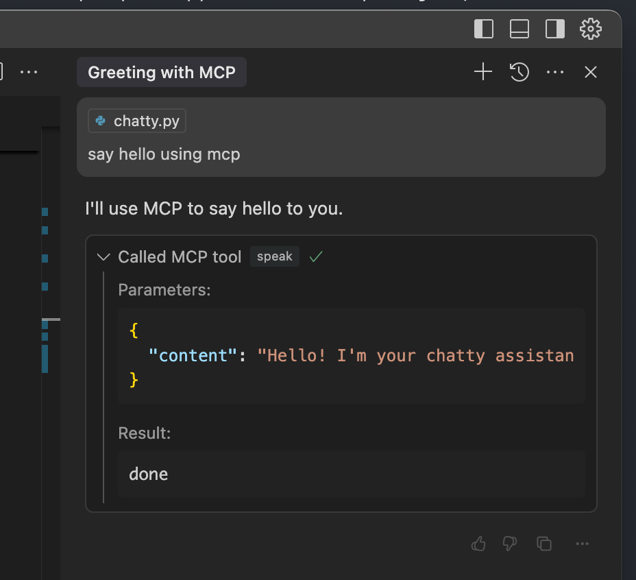

# Testing MCP Speech Manually

Test the speech functionality by running:

```
uv run chatty.py --engine kokoro --streaming --test-voice kokoro
```

# Requesting Speech Explicitly

You can directly invoke speech through your MCP client:



# Enabling Debug Logs

To capture detailed logs for troubleshooting:

```
uv run chatty.py --engine kokoro --streaming --log-dir /path/to/log/directory
```

